# Cyber Crime Complaint Management System

A comprehensive, full-stack web application designed for citizens to securely report and track cybercrimes, and for administrators to manage and triage those reports efficiently. 

The project separates the client UI and the server-side logic into two distinct layers for better maintainability and scalability.

---

## Folder Structure

The repository is structured into two main directories:

- `/backend` → handles server-side logic, RESTful APIs, database connections, and authentication.

- `/frontend` → handles the user interface, client-side functionality, routing, and global state management.


---

## Tech Stack

This project is built using the **MERN** stack architecture (using SQL instead of NoSQL):

**Frontend:**
- React.js (Vite)
- React Router DOM v6
- Context API (State Management)
- Tailwind CSS
- Framer Motion (Animations)
- Axios

**Backend:**
- Node.js
- Express.js
- Microsoft SQL Server (Relational Database)
- JSON Web Tokens (JWT) for Authentication
- bcryptjs for password hashing
- Swagger UI (API Documentation)

---

## Features

- **Secure Authentication:** Role-based access control (RBAC) with secure JWT handling for Citizens and Admins. User tokens and Admin tokens are strictly separated — a citizen token cannot access admin routes.
- **API Documentation:** Interactive Swagger UI available at `/api-docs` to explore and test all endpoints directly from the browser.
- **Citizen Portal:**
  - File detailed cybercrime complaints securely.
  - Track the real-time status of submitted complaints.
  - View a history of previously filed reports.
- **Admin Dashboard:**
  - View overarching system statistics and complaint ratios.
  - Triage, review, and update the status of active complaints.
  - Search and filter complaints through the database seamlessly.
- **Responsive Design:** Beautiful, dynamic, and mobile-friendly UI crafted with Tailwind CSS and Framer Motion.
- **Dark Mode Support:** Full system-preference aware light and dark mode toggling.

---

## Installation Instructions

Follow these steps to get the project running on your local machine.

### Prerequisites
- Node.js (v18 or higher)
- npm or yarn
- Microsoft SQL Server (local install)
- SQL Server Configuration Manager — TCP/IP must be enabled on port 1433

### 1. Backend Setup

Open a terminal and navigate to the backend directory:

```bash
cd backend
npm install
```

Configure your environment variables (see the Environment Variables section below), then start the server:

```bash
# For development (with nodemon)
npm run dev

# For production
npm start
```

### 2. Frontend Setup

Open a separate terminal window and navigate to the frontend directory:

```bash
cd frontend
npm install
```

Start the Vite development server:

```bash
npm run dev
```

---

## Environment Variables

**Backend (`/backend/.env`):**
```env
PORT=5000
DB_SERVER=localhost
DB_PORT=1433
DB_DATABASE=CyberCrimeDB
DB_USER=sa
DB_PASSWORD=your_db_password
JWT_SECRET=your_super_secret_jwt_key
JWT_EXPIRES_IN=7d
```

**Frontend (`/frontend/.env`):**
```env
VITE_API_BASE_URL=http://localhost:5000
```

---

## API Documentation (Swagger UI)

This project includes interactive API documentation powered by **Swagger UI**.

Once the backend server is running, open your browser and navigate to:

```
http://localhost:5000/api-docs
```

You will see a full list of all available endpoints, request bodies, response schemas, and status codes — all testable directly from the browser.

### How to authenticate in Swagger UI

1. Use `POST /api/users/login` or `POST /api/admin/login` to log in and copy the `token` from the response.
2. Click the **Authorize 🔒** button at the top right of the Swagger page.
3. Paste your token and click **Authorize**.
4. All protected routes will now automatically include your token.

> **Note:** User tokens and Admin tokens are role-restricted. A user token will be rejected with `403 Access denied` on any `/api/admin/*` route, and vice versa.

---

## API Endpoints Reference

| Method | Endpoint | Auth | Description |
|--------|----------|------|-------------|
| `POST` | `/api/users/register` | ❌ Public | Register a new citizen account |
| `POST` | `/api/users/login` | ❌ Public | Citizen login — returns JWT |
| `POST` | `/api/admin/login` | ❌ Public | Admin login — returns JWT |
| `POST` | `/api/complaints` | ✅ User JWT | File a new complaint |
| `GET` | `/api/complaints/my` | ✅ User JWT | Get logged-in user's own complaints |
| `GET` | `/api/admin/complaints` | ✅ Admin JWT | Get all complaints (admin view) |
| `GET` | `/api/admin/complaints/:id` | ✅ Admin JWT | Get single complaint detail |
| `PUT` | `/api/admin/update-status/:id` | ✅ Admin JWT | Update complaint status |

**Valid complaint statuses:** `Pending` → `In Progress` → `Resolved` → `Rejected`

---

## Screenshots

### 🖥️ Frontend UI (Application Screenshots)
| Home - Light Mode | Home - Dark Mode |
| :---: | :---: |
| 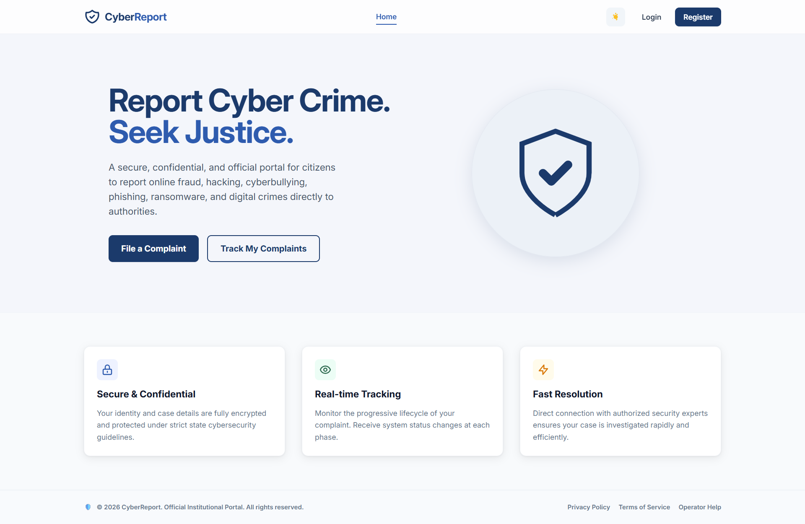 | 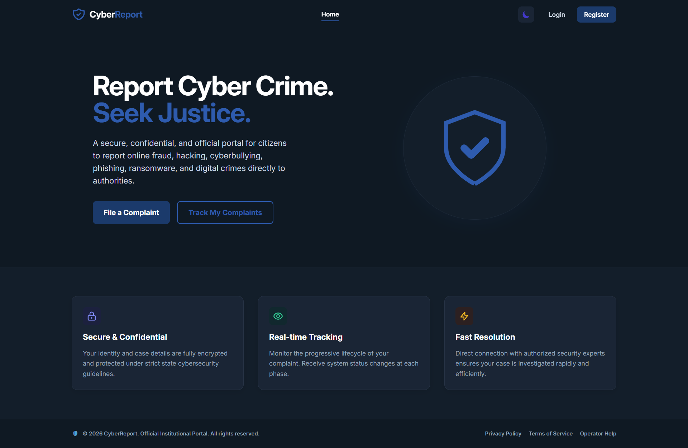 |

| User Registration | User Login |
| :---: | :---: |
| 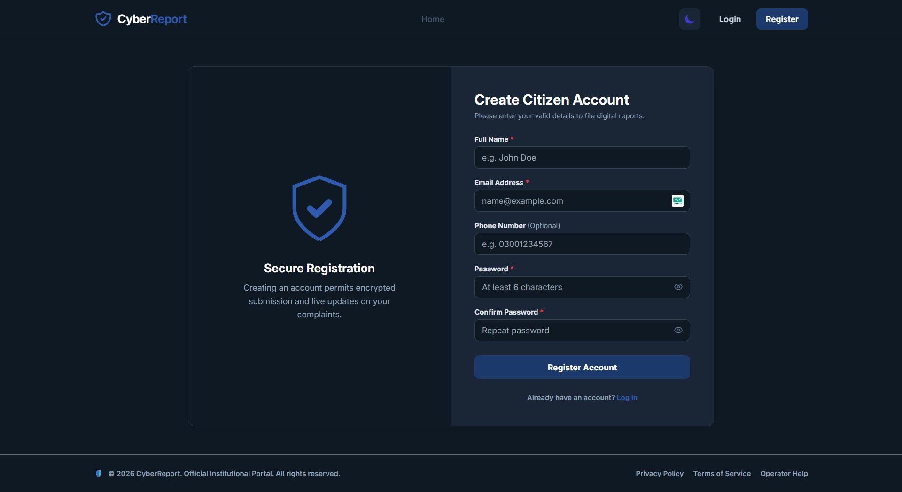 | 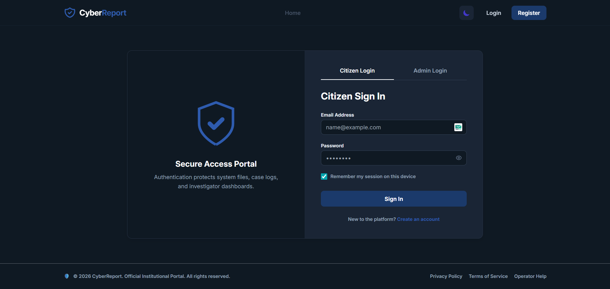 |

| User Dashboard | Admin Dashboard |
| :---: | :---: |
| 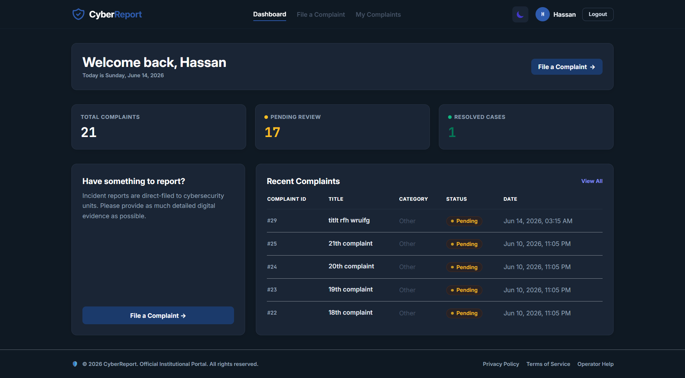 | 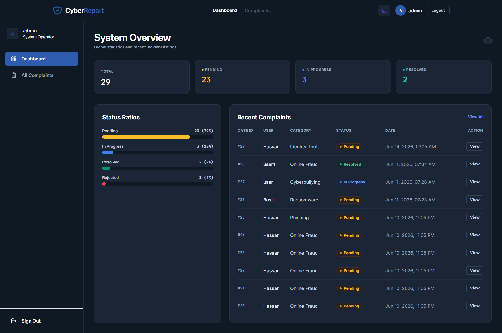 |

| View Complaints | Search Complaints |
| :---: | :---: |
| 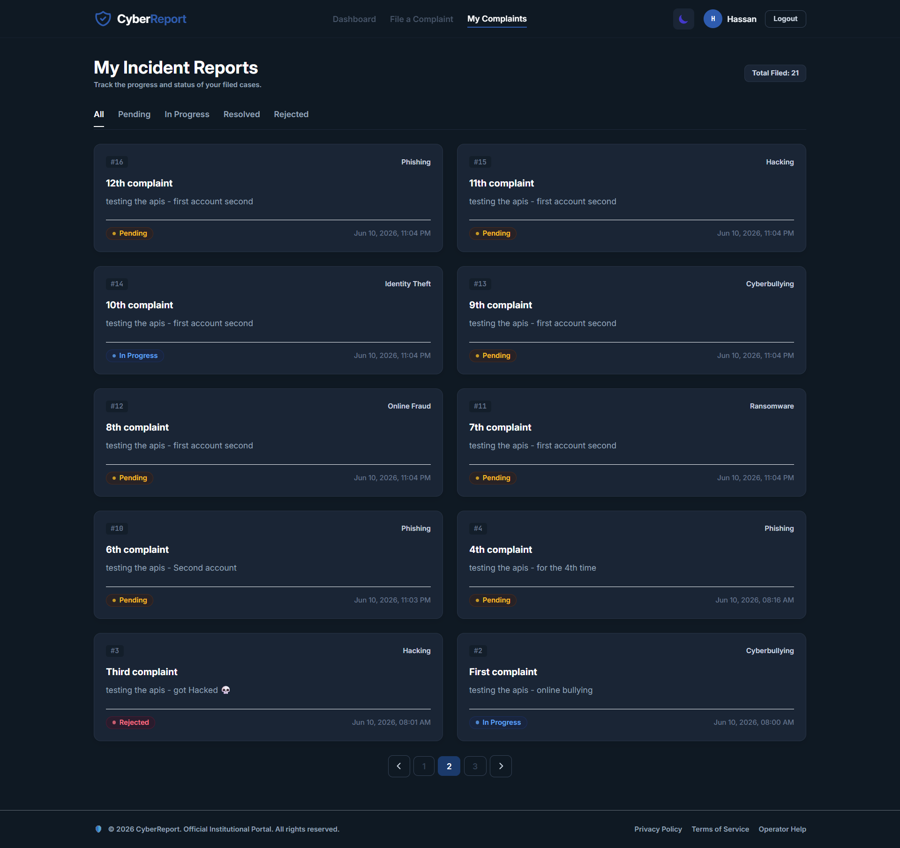 | 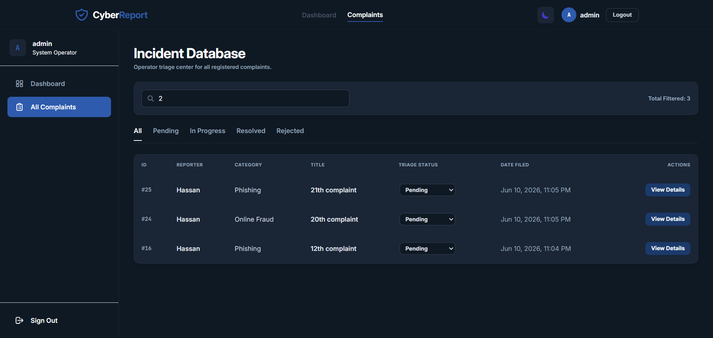 |

| All Complaints (Admin view) |
| :---: |
| 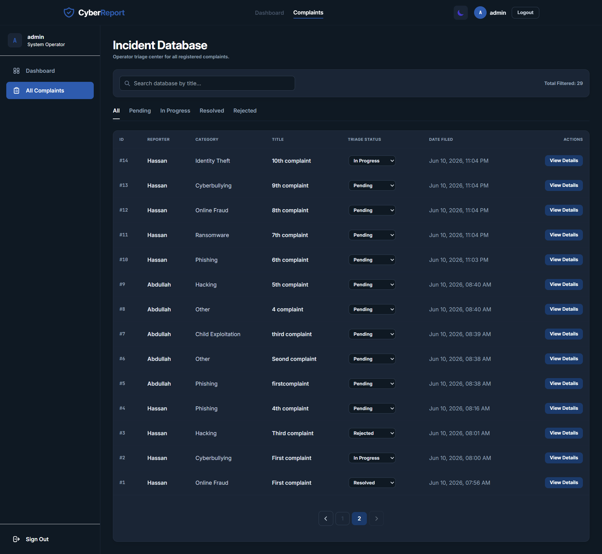 |

---

### 📄 API Documentation (Swagger UI)

| Swagger UI |
| :---: |
| 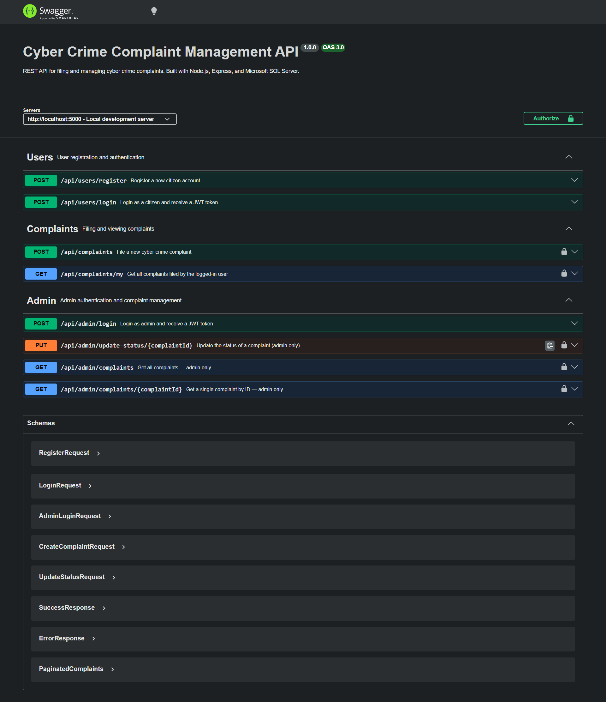 |

---

### 🚀 Backend API Testing (Postman Results)
The backend REST APIs were thoroughly tested using Postman. Below are the successful API endpoint results:

* **Authentication & Authorization**
  * 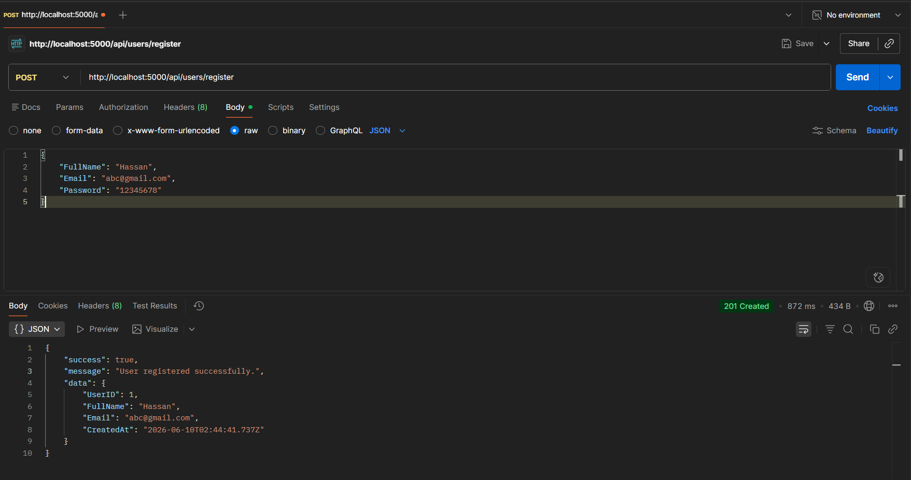
  * 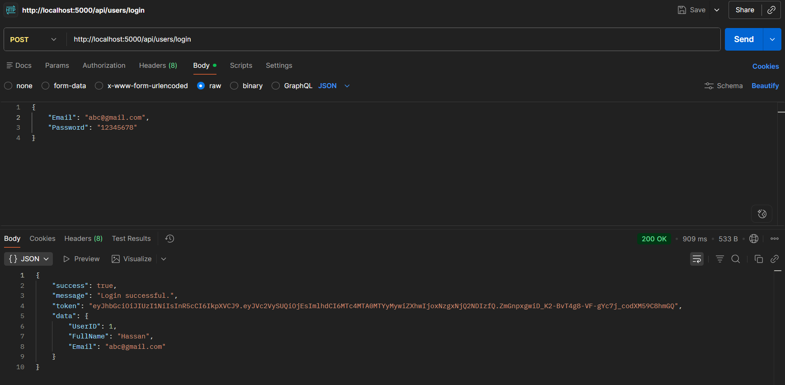
  * 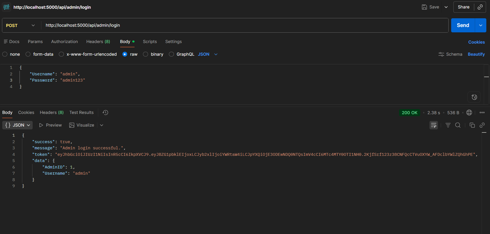

* **Complaint Management & Lifecycle**
  * 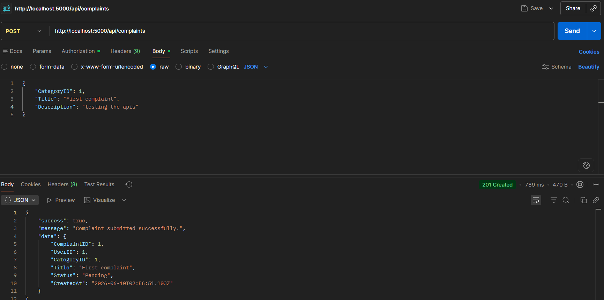
  * 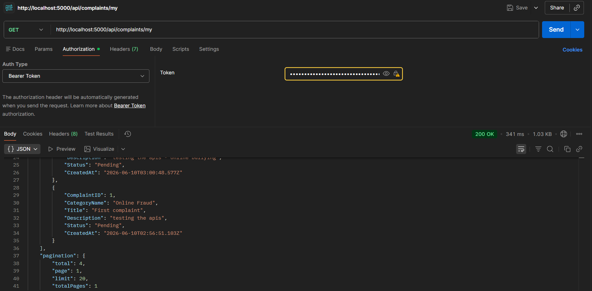
  * 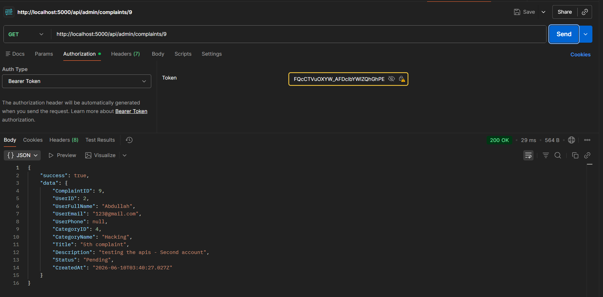
  * 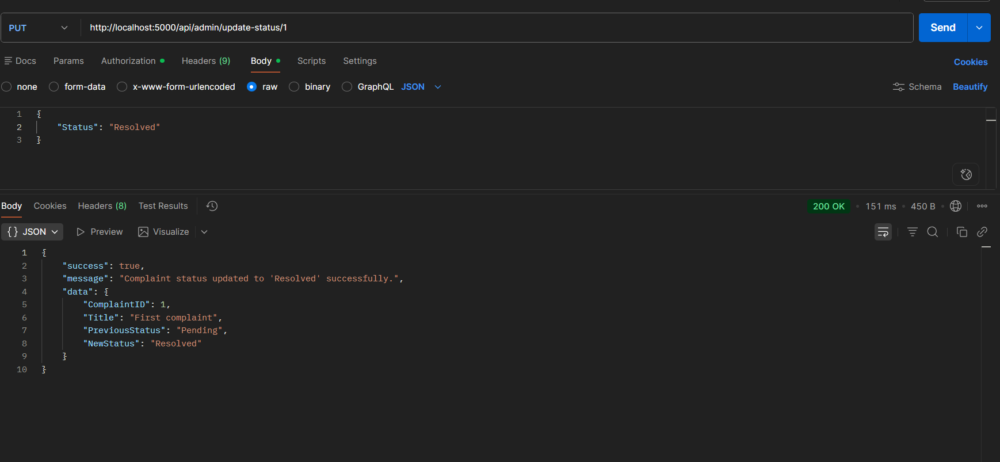

---

## Usage

1. Start the **backend** server (`npm run dev` in the `/backend` folder) — runs on `http://localhost:5000`.
2. Start the **frontend** development server (`npm run dev` in the `/frontend` folder) — runs on `http://localhost:3000`.
3. Open your browser and navigate to the frontend URL.
4. Register a new citizen account or log in with admin credentials to explore the system.
5. To explore the API interactively, visit `http://localhost:5000/api-docs`.

## Future Improvements

- Implementing Two-Factor Authentication (2FA) for admin accounts.
- Adding real-time email or SMS notifications for complaint status updates.
- Exporting reports and statistics to PDF/CSV formats.
- Integrating an AI chatbot to assist citizens in categorizing their complaints.

## Contributing

Contributions are always welcome! 

1. Fork the project.
2. Create your feature branch (`git checkout -b feature/AmazingFeature`).
3. Commit your changes (`git commit -m 'Add some AmazingFeature'`).
4. Push to the branch (`git push origin feature/AmazingFeature`).
5. Open a Pull Request.

## License

This project is licensed under the MIT License - see the [LICENSE](LICENSE) file for details.
